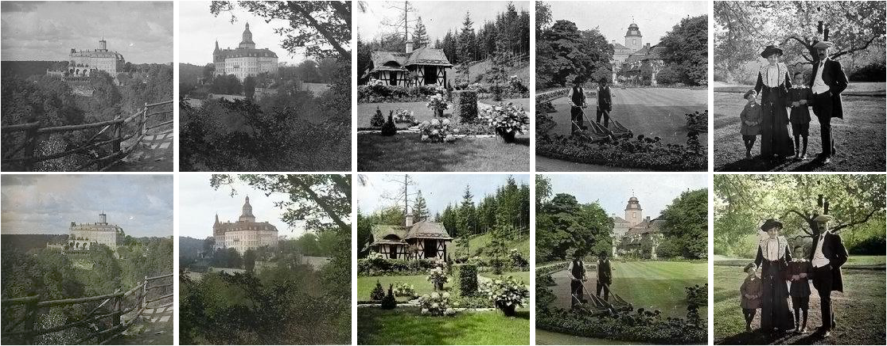
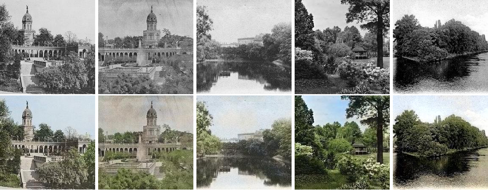
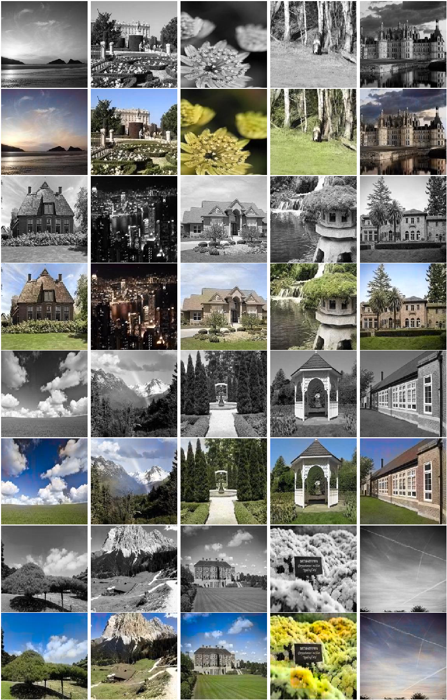

## Colorized 100 years old photos of Książ Castle

Source: _Louis Hardouin, Książ Castle archive_

## Wrocław (Breslau) 18/19th century

From the left: Liebichshöhe ̈(Wzgórze  Partyzantów) 1894;  Wzgórze  Partyzantów and fountain, 1894; city moat, 1898; Japanese Garden, 1930-1937; Słodowa Island, 1905-1908. Source: _fotopolska.eu_.

## _Other colorized images:_

Places365 / test dataset.